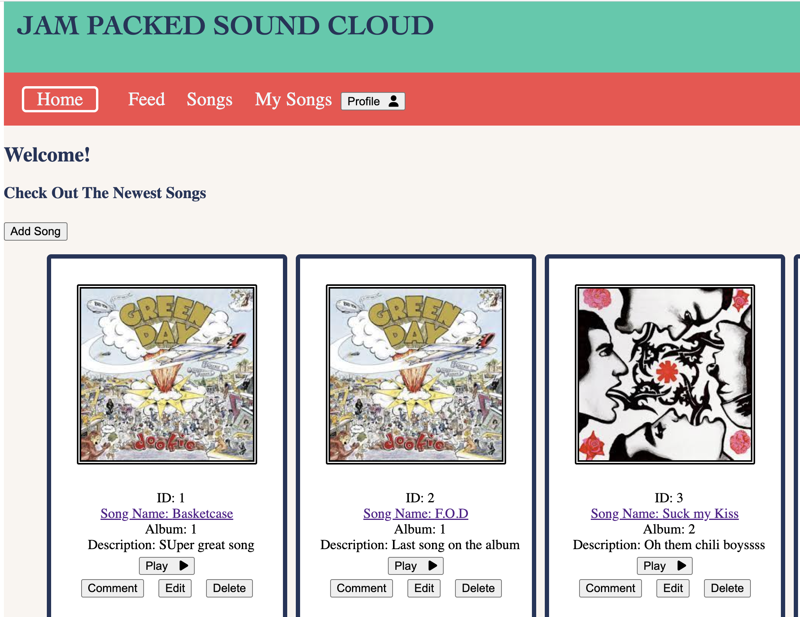
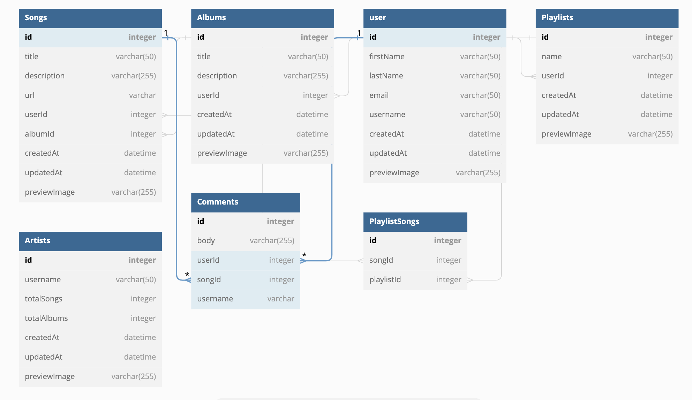

# Welcome the the Jam Packed Sound Cloud!

[Jam Packed Sound Cloud](https://soundcloud-web-server.onrender.com).

This is a fun place to upload, edit, delete, read and listen to/comment about your favorite songs! Explore around the website to get a better idea of the capabilities. To summarize the main features include:

### `Songs Page`

This feature allows anyone to browse through our music library, read about a song, see the artwork, , and includes links to listen to the music.

### `Create a profile`

This feature allows you to upload music along with the capabilities of commenting on any song. You are also able to edit and delete your uploaded songs and comments.

### `Commenting`

Leave feedback on how a certain song makes you feel. Read what others had to say as well!

### `New Songs`

Our library displays the newest songs that were uploaded at the top of the page so you are able to check out new music whenever you enter the website.

### `My Profile`

This page allows you to see information about your profile and to view only your songs.

There are several programs used in the project.
* Node.js <i class="devicon-nodejs-plain"></i>
* Express
* Sequelize
* Sqlite3
* React
* Redux
* Html5
* Css
* Git
* Javascript

## Available Scripts

In the project directory, you can run:

cd into the backend and into the from in your terminal and run `npm install` to gain all the proper dependencies.
Next you will want to cd into your backend folder. There you need to create a .env  file to store you database. Use `DB_FILE` as the variable set to whatever is is you name you database. For example you can use `DB_FILE=db/dev.db`

After this you'll want to set up your migrations, models, and seeders. Once they are set up you can run the command
`npx dotenv sequelize db:migrate && npx dotenv sequelize db:seed:all` which will run the migrations and seeders and fill the database with the information submitted.

For a visual you can go to 	[Db Diagram](https://dbdiagram.io/) and test out how you want your schema to look.

### `npm start`

Runs the app in the development mode.\
Open [http://localhost:3000](http://localhost:3000) to view it in the browser.

Feel free to look through the code and familiarize yourself with it.

The page will reload if you make edits.
You will also see any lint errors in the console.

If you ever need to add or edit your migrations or seeders use the command `npm run rebuild` which will reseed and migrate any changes and create a whole database with the changes.

Add some music and have fun!
